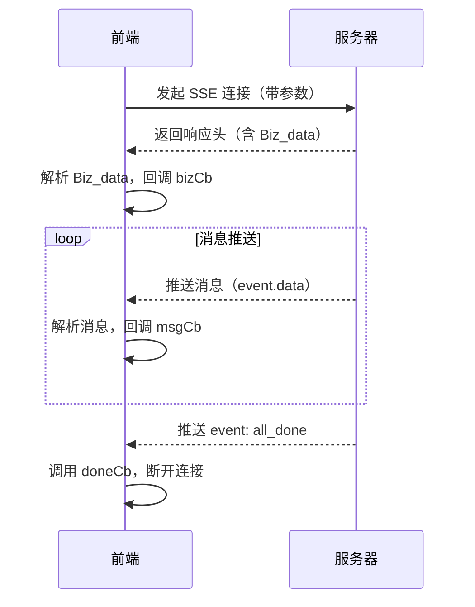

# SSE 流程讲解

## 1. 背景

SSE（Server-Sent Events，服务端推送事件）是一种服务端主动推送消息到浏览器的技术，适合实时数据流场景，如 AI 聊天、实时搜索等。相比 WebSocket，SSE 更轻量，适合单向推送。

## 2. 主要流程

### 2.1 参数准备

- 使用 `qs.stringify` 将参数对象序列化为 URL 查询字符串。
- 拼接 API 地址，带上参数。

```js
let param = qs.stringify(params)
const url = `https://***.com/search/api/v1/chat_stream?${param}`
```

### 2.2 创建 AbortController

- 用于后续中断 SSE 连接。

```js
const ctrl = new AbortController()
```

### 2.3 fetchEventSource 调用

- 使用 `@microsoft/fetch-event-source` 库发起 SSE 连接。
- 传入 url、signal 及一系列事件回调。

#### 主要回调说明

- **onopen**  
  连接建立时触发。解析响应头中的 `Biz_data`，并通过 `bizCb` 回调传递业务数据。

- **onmessage**  
  每收到一条消息触发。  
  - 如果 `data.event === 'all_done'`，说明传输结束，调用 `doneCb` 并中断连接。
  - 否则，调用 `msgCb` 处理文本消息。

- **onclose**  
  连接关闭时触发，做日志记录。

- **onerror**  
  发生错误时触发，调用 `errorCb` 并抛出异常。

```js
fetchEventSource(url, {
  signal: ctrl.signal,
  openWhenHidden: true,
  async onopen(response) { ... },
  onmessage(event) { ... },
  onclose() { ... },
  onerror(err) { ... },
})
```

### 2.4 返回中断控制器

- 返回 `ctrl`，便于外部主动中断 SSE 连接。

```js
return ctrl
```

## 3. 流程时序图



---

# 前端 AI 开发亮点

## 1. 流式响应体验

利用 SSE 实现 AI 聊天/搜索的流式输出，用户可实时看到 AI 生成内容，极大提升交互体验。

## 2. 中断与容错机制

- 通过 AbortController 支持用户主动中断请求，提升灵活性。
- 错误处理完善，能及时反馈异常，保证前端健壮性。

## 3. 多回调解耦

业务数据、消息、完成、错误分别通过回调处理，便于扩展和维护。

## 4. 灵活的参数与业务扩展

- 支持动态参数拼接，适配多种 AI 场景。
- 业务数据（如 Biz_data）可灵活扩展，支持多业务线。

## 5. 可复用的 API 封装

将 SSE 逻辑封装为通用方法，便于在不同 AI 场景下复用。

## 6. 前端智能化能力提升

结合 AI 能力，前端可实现智能问答、智能推荐、自动补全等创新功能，提升产品智能化水平。

---

# 进一步探索方向

## AI 辅助功能

- AI 辅助表单填写、智能搜索建议
- 智能客服、FAQ 自动应答
- 实时内容审核与提示
- 结合大模型实现代码/文档自动生成

## 技术亮点

- **实时性**：SSE 提供真正的实时体验
- **可中断性**：支持用户主动控制
- **容错性**：完善的错误处理机制
- **扩展性**：模块化设计便于功能扩展
- **复用性**：通用封装便于多场景应用

这些都是前端结合 AI 能力可以持续创新的方向。
