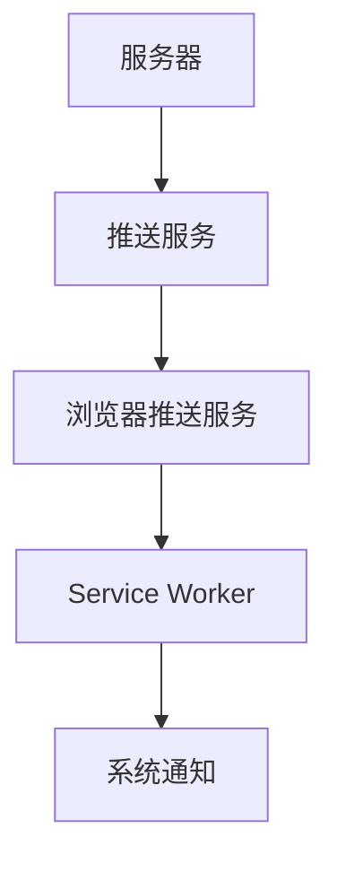

# PWA 使用指南

## 什么是 PWA？

PWA（Progressive Web App）是一种使用现代 Web 技术构建的应用程序，具有以下特性：

- **可安装**: 可以像原生应用一样安装到设备上
- **离线工作**: 即使没有网络连接也能正常工作
- **推送通知**: 支持系统级推送通知
- **原生体验**: 提供接近原生应用的用户体验

## 本项目 PWA 特性

### 1. 应用清单 (Web App Manifest)

项目使用 `assets/manifest.json` 定义 PWA 的基本信息：

```json
{
    "name": "JOY",
    "short_name": "JOY",
    "display": "standalone",
    "start_url": "/apps/fe-pwa/push/",
    "theme_color": "#ffffff",
    "background_color": "#ffffff",
    "icons": [...]
}
```

**关键配置说明：**

- `display: "standalone"`: 应用以独立窗口运行，隐藏浏览器地址栏
- `start_url`: 应用启动时的入口页面
- `theme_color`: 应用主题色，影响状态栏颜色
- `background_color`: 启动画面背景色

### 2. Service Worker

Service Worker 是 PWA 的核心组件，提供离线缓存功能：

#### 注册 Service Worker

```javascript
// 在页面中注册 Service Worker
if ('serviceWorker' in navigator) {
  navigator.serviceWorker.register('/js/service-worker.js')
    .then(registration => {
      console.log('SW registered: ', registration);
    })
    .catch(registrationError => {
      console.log('SW registration failed: ', registrationError);
    });
}
```

#### 缓存策略

当前项目使用以下缓存策略：

```javascript
// 缓存名称
var cacheName = 'EC_CACHE';

// 需要缓存的文件列表
var urlsToCache = ['/apps/fe-pwa/js/test.js'];

// 安装时缓存资源
self.addEventListener('install', function(event) {
  event.waitUntil(
    caches.open(cacheName)
      .then(function(cache) {
        return cache.addAll(urlsToCache);
      })
  );
});
```

### 3. OneSignal 推送通知

项目集成了 OneSignal 推送服务，支持跨平台推送通知：

#### 初始化配置

```javascript
// 根据环境获取配置
const appId = getConfig();

// 初始化 OneSignal
await OneSignal.init({
  appId: appId,
  notifyButton: {
    enable: true,
  }
});

// 显示原生提示
OneSignal.showNativePrompt();
```

#### 用户标识

```javascript
// 设置外部用户 ID
if (this.email) {
  OneSignal.setExternalUserId(this.email);
}
```

## 如何使用 PWA

### 1. 安装 PWA

#### 桌面浏览器

1. 访问 PWA 网站
2. 在地址栏右侧点击"安装"图标
3. 选择"安装"选项
4. PWA 将安装到桌面或开始菜单

#### 移动设备

**Android (Chrome):**

1. 访问 PWA 网站
2. 点击菜单中的"添加到主屏幕"
3. 确认安装

**iOS (Safari):**

1. 访问 PWA 网站
2. 点击分享按钮
3. 选择"添加到主屏幕"

### 2. 离线使用

PWA 支持离线使用：

1. **首次访问**: 在联网状态下访问网站，Service Worker 会缓存必要资源
2. **离线访问**: 断开网络后仍可访问已缓存的内容
3. **后台同步**: 网络恢复时自动同步数据

### 3. 推送通知

#### 底层原理

PWA 推送消息采用**半原生**架构实现：

**技术栈组成：**
- **Web Push API**: 浏览器原生推送接口
- **Service Worker**: 后台处理推送事件
- **VAPID 协议**: 推送身份验证
- **系统推送服务**: FCM、APNs 等

**推送流程：**


**具体实现步骤：**

1. **用户订阅推送**
```javascript
// 浏览器生成推送订阅
const subscription = await serviceWorkerRegistration.pushManager.subscribe({
  userVisibleOnly: true,
  applicationServerKey: vapidPublicKey
});
```

2. **服务器发送推送**
```javascript
// 通过推送服务发送消息
fetch('https://fcm.googleapis.com/fcm/send', {
  method: 'POST',
  headers: {
    'Authorization': 'key=YOUR_SERVER_KEY',
    'Content-Type': 'application/json'
  },
  body: JSON.stringify({
    to: subscription.endpoint,
    notification: {
      title: 'JOY',
      body: '新消息'
    }
  })
});
```

3. **Service Worker 处理**
```javascript
// 接收推送事件并显示系统通知
self.addEventListener('push', event => {
  const options = {
    body: event.data.text(),
    icon: '/images/icon-192.png',
    badge: '/images/badge-72.png'
  };
  
  event.waitUntil(
    self.registration.showNotification('JOY', options)
  );
});
```

#### 订阅通知

1. 首次访问时，浏览器会请求通知权限
2. 用户同意后，应用可以发送推送通知
3. 通知会显示在系统通知栏中

#### 通知类型

- **营销通知**: 产品推广、活动信息
- **系统通知**: 重要更新、维护信息
- **个性化通知**: 基于用户行为的定制通知

#### 与原生 App 推送对比

| 特性 | PWA 推送 | 原生 App 推送 |
|------|----------|---------------|
| **实现方式** | Web Push API + Service Worker | 原生 SDK |
| **推送服务** | 浏览器推送服务 | 系统推送服务 |
| **权限管理** | 浏览器权限 | 系统权限 |
| **离线能力** | Service Worker 缓存 | 原生缓存 |
| **跨平台** | 需要适配不同浏览器 | 需要适配不同平台 |

## 开发最佳实践

### 1. 性能优化

#### 资源缓存

```javascript
// 缓存关键资源
const criticalResources = [
  '/css/main.css',
  '/js/app.js',
  '/images/logo.png'
];

// 使用 Cache First 策略
self.addEventListener('fetch', event => {
  if (event.request.destination === 'image') {
    event.respondWith(
      caches.match(event.request)
        .then(response => response || fetch(event.request))
    );
  }
});
```

#### 图片优化

- 使用 WebP 格式
- 提供多种尺寸的图标
- 实现懒加载

### 2. 用户体验

#### 启动画面

```json
{
  "name": "JOY",
  "short_name": "JOY",
  "background_color": "#ffffff",
  "theme_color": "#ffffff",
  "display": "standalone",
  "start_url": "/",
  "icons": [
    {
      "src": "/images/icon-192.png",
      "sizes": "192x192",
      "type": "image/png"
    }
  ]
}
```

#### 离线页面

```javascript
// 提供离线页面
self.addEventListener('fetch', event => {
  if (event.request.mode === 'navigate') {
    event.respondWith(
      fetch(event.request)
        .catch(() => {
          return caches.match('/offline.html');
        })
    );
  }
});
```

### 3. 安全性

#### HTTPS 要求

PWA 必须在 HTTPS 环境下运行：

```javascript
// 检查 HTTPS
if (location.protocol !== 'https:' && location.hostname !== 'localhost') {
  console.warn('PWA requires HTTPS');
}
```

#### 内容安全策略

```html
<meta http-equiv="Content-Security-Policy" 
      content="default-src 'self'; script-src 'self' 'unsafe-inline' https://cdn.onesignal.com;">
```

## 调试和测试

### 1. Chrome DevTools

#### Application 面板

1. 打开 DevTools
2. 切换到 Application 面板
3. 查看 Manifest、Service Workers、Storage 等信息

#### Lighthouse 审计

1. 打开 DevTools
2. 切换到 Lighthouse 面板
3. 选择 PWA 审计
4. 生成报告并查看建议

### 2. 常见问题排查

#### Service Worker 不更新

```javascript
// 强制更新 Service Worker
navigator.serviceWorker.getRegistrations().then(registrations => {
  for(let registration of registrations) {
    registration.unregister();
  }
});
```

#### 推送通知不工作

1. 检查浏览器权限设置
2. 确认 OneSignal App ID 正确
3. 验证 HTTPS 环境
4. 检查网络连接

#### PWA 安装失败

1. 确认 manifest.json 配置正确
2. 检查图标文件是否存在
3. 验证 HTTPS 协议
4. 确认 display 模式设置

## 多地区部署

### 地区特定配置

每个地区可以有不同的配置：

```javascript
// 地区配置
const regionConfigs = {
  usa: {
    appId: 'usa-onesignal-app-id',
    startUrl: '/usa/',
    themeColor: '#ff0000'
  },
  uk: {
    appId: 'uk-onesignal-app-id', 
    startUrl: '/uk/',
    themeColor: '#0000ff'
  }
};
```

### 动态配置

```javascript
// 根据地区动态加载配置
function getRegionConfig() {
  const hostname = window.location.hostname;
  if (hostname.includes('usa')) return regionConfigs.usa;
  if (hostname.includes('uk')) return regionConfigs.uk;
  return regionConfigs.usa; // 默认配置
}
```

## 监控和分析

### 1. 性能监控

```javascript
// 监控 Service Worker 性能
self.addEventListener('install', event => {
  const startTime = performance.now();
  event.waitUntil(
    caches.open('v1').then(cache => {
      const endTime = performance.now();
      console.log(`Cache opened in ${endTime - startTime}ms`);
    })
  );
});
```

### 2. 错误追踪

```javascript
// 捕获 Service Worker 错误
self.addEventListener('error', event => {
  console.error('Service Worker error:', event.error);
  // 发送错误报告
});
```

### 3. 用户行为分析

```javascript
// 追踪 PWA 安装
window.addEventListener('beforeinstallprompt', event => {
  event.userChoice.then(choiceResult => {
    if (choiceResult.outcome === 'accepted') {
      console.log('User accepted PWA installation');
      // 发送安装事件
    }
  });
});
```

## 未来扩展

### 1. 后台同步

```javascript
// 实现后台同步
self.addEventListener('sync', event => {
  if (event.tag === 'background-sync') {
    event.waitUntil(doBackgroundSync());
  }
});
```

### 2. 推送通知增强

```javascript
// 自定义推送通知
self.addEventListener('push', event => {
  const options = {
    body: event.data.text(),
    icon: '/images/icon-192.png',
    badge: '/images/badge-72.png',
    actions: [
      {action: 'view', title: '查看'},
      {action: 'dismiss', title: '忽略'}
    ]
  };
  
  event.waitUntil(
    self.registration.showNotification('JOY', options)
  );
});
```

### 3. 离线数据同步

```javascript
// 离线数据存储和同步
const dbName = 'offline-db';
const dbVersion = 1;

const request = indexedDB.open(dbName, dbVersion);

request.onsuccess = event => {
  const db = event.target.result;
  // 处理离线数据
};
```

这个 PWA 使用指南涵盖了从基础概念到高级功能的完整内容，帮助开发者更好地理解和使用 PWA 技术。
