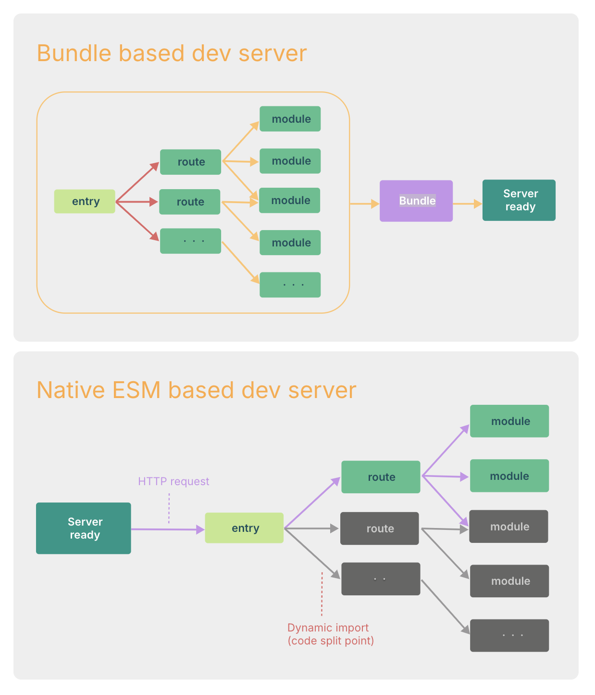

# 为什么选 Vite

## 前言

ES Module（ESM）：浏览器与 Node 均已广泛支持的原生模块化标准。

在浏览器支持 ES 模块之前，JavaScript 并没有原生模块化机制。这也是我们对“打包”概念熟悉的原因：使用工具抓取、处理并将源码模块串联成可在浏览器运行的文件。

时过境迁，我们见证了如 `Webpack`、`Rollup`、`Parcel` 等工具的演进，它们极大改善了开发体验。

然而，超大规模应用的模块数量可达数千，传统基于打包器的开发服务器冷启动/热更新容易遇到性能瓶颈（分钟级冷启动、秒级 HMR）。慢反馈显著影响效率与体验。

`Vite` 借助两点行业趋势解决以上问题：浏览器原生支持 `ESM`，以及构建工具逐步采用编译型语言（如 `Go`/`Rust`）。

### 缓慢的服务器启动

基于打包器的方式在冷启动时需要先抓取并构建整个应用，才能提供服务。

`Vite` 将模块分为「依赖」与「源码」两类，从根源优化启动时间。

依赖：通常在开发时稳定，且可能体量很大、格式多样（`ESM`/`CJS`）。`Vite` 使用 `esbuild` 做依赖预构建（`Go` 实现），较 JS 实现的打包器快 10-100 倍。

源码：常包含需转换的文件（`JSX`、`CSS`、`Vue/Svelte` 组件），会被频繁编辑，且并非一次性加载。`Vite` 以原生 `ESM` 提供源码，按需转换并下发，结合动态导入仅在使用时处理。

基于打包器的开发服务器

### 缓慢的更新

打包器模式下，重建成本随体积上升而上升，即便缓存/内存化也常需重建大块并触发整页刷新。

部分打包器会将构建产物保存在内存中，并在文件更改时使模块图子集失活，但仍可能重建较多内容并整页刷新；虽有 `HMR`，大型项目下热更新速度仍易受影响。

在 `Vite` 中，`HMR` 基于原生 `ESM`：只失活变更模块到最近 `HMR` 边界之间的链（多为模块本身），应用越大优势越明显。

另外利用 HTTP 头：源码模块走 `304` 协商缓存；依赖模块走强缓存 `Cache-Control: max-age=31536000, immutable`，命中后无需再次请求。

一旦体验到 `Vite` 的速度，再回到传统打包器开发通常会明显感到迟缓。

### 为什么生产环境仍需打包

尽管原生 `ESM` 已广泛支持，但未打包发布会带来额外网络往返（嵌套导入），影响加载效率。生产环境仍需 `tree-shaking`、懒加载与 `chunk` 分割，以优化体积与缓存。

为保证开发与生产的一致性与最优输出，`Vite` 内置生产构建命令（基于 `Rollup`），开箱即用。

### 为何不用 esbuild 打包？

虽然 `esbuild` 极快，且用于构建库已相当出色，但在应用打包上（如高级代码分割、CSS 处理生态）`Rollup` 更成熟灵活。未来功能完善后，不排除 `esbuild` 作为生产构建器的可能。

### 打包 or 不打包

`Vite` 引发一个思考：是否还有必要打包应用？

过去我们使用 `Webpack` 打包为 `bundle.js`，主要因为：

1）浏览器环境曾不支持模块化
2）零散模块带来大量 HTTP 请求
随着浏览器对 ES 标准支持完善，第一个问题基本已消失；现代浏览器普遍支持 `ESM`。

## 总结

`Vite` 通过依赖预构建（`esbuild`）与基于 `ESM` 的按需加载，显著提升冷启动与热更新体验；生产默认使用 `Rollup` 以获得成熟的优化能力。

### 参考文献

1. <https://cn.vitejs.dev/guide/why.html#slow-server-start>
