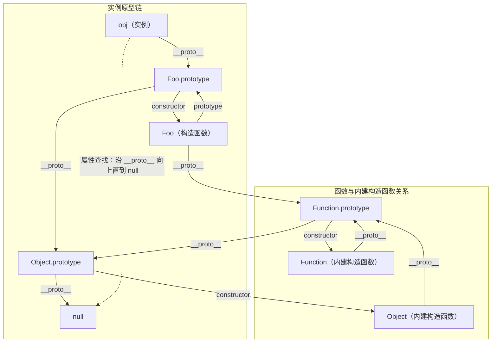
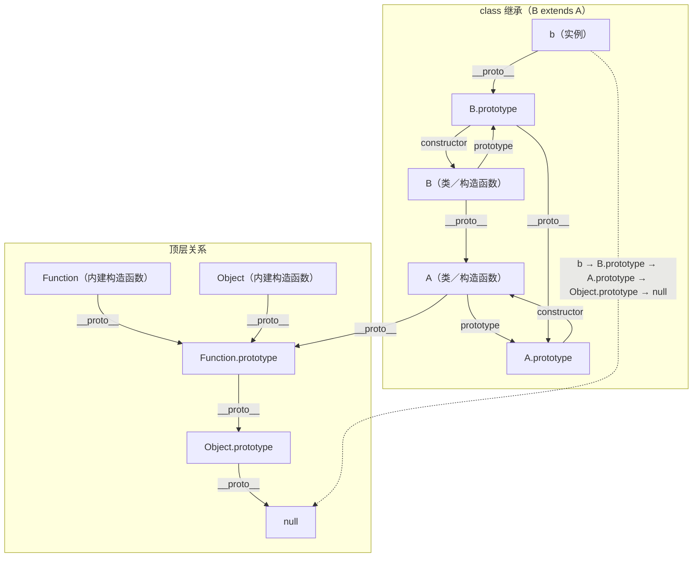
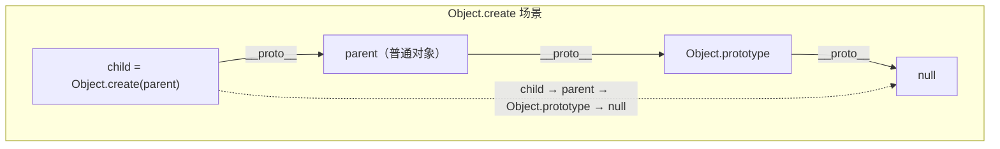

## JavaScript 原型链（图与要点）

### 1）总览：实例、构造函数与内建构造函数



要点：

- 实例 `obj` 的内部原型（[[Prototype]]）指向 `Foo.prototype`。
- 构造函数 `Foo` 通过其 `prototype` 属性提供实例共享的方法。
- 所有函数（包括内建 `Object`／`Function`）都是 `Function.prototype` 的实例。
- `Function.prototype.__proto__ === Object.prototype`，顶端为 `null`。

---

### 2）class 继承（B extends A）



要点：

- 实例 `b` 的查找路径：`b → B.prototype → A.prototype → Object.prototype → null`。
- 类构造器 `A`、`B` 本身都是函数，`A.__proto__ === Function.prototype`，`B.__proto__ === A`（由 `extends` 建立）。

---

### 3）Object.create 场景



要点：

- `child` 的原型直接指向 `parent`，再到 `Object.prototype`，最后到 `null`。

---

### 4）为什么实例没有 `prototype`

- `prototype` 是“构造函数”的属性，供 `new` 时把新对象的 [[Prototype]] 指向它。
- 实例只有内部槽 [[Prototype]]，可通过 `__proto__` 或 `Object.getPrototypeOf` 访问；实例上没有名为 `prototype` 的属性。
- 若要变更实例原型，应使用 `Object.setPrototypeOf` 或 `__proto__`。
- 只有“可构造”的函数才有 `prototype`；箭头函数、`bind` 返回的函数没有。

```js
function Foo() {}
const obj = new Foo();

typeof Foo.prototype;                        // "object"
'prototype' in obj;                          // false（实例没有 prototype）
Object.getPrototypeOf(obj) === Foo.prototype; // true
(() => {}).prototype;                        // undefined（箭头函数不可构造）
```

---

### 5）函数有 `__proto__` 吗?

- 有。函数也是对象，拥有 [[Prototype]]，可用 `__proto__`／`Object.getPrototypeOf` 访问。
- 普通函数／类／箭头函数／绑定函数的 `__proto__` 都是 `Function.prototype`。
- `Function.prototype.__proto__ === Object.prototype`。

```js
function Foo() {}
Foo.__proto__ === Function.prototype;          // true
(() => {}).__proto__ === Function.prototype;   // true

const bound = Foo.bind(null);
bound.__proto__ === Function.prototype;        // true
'prototype' in (() => {})                      // false
'prototype' in bound                           // false

Object.getPrototypeOf(Foo) === Function.prototype; // 推荐用法，true
```

---

### 6）内建 Object／Function 的 Prototype 指向

- `Object.prototype.__proto__ === null`
- `Function.prototype.__proto__ === Object.prototype`
- `Object.__proto__ === Function.prototype`
- `Function.__proto__ === Function.prototype`（自指）

```js
Object.getPrototypeOf(Object.prototype) === null;               // true
Object.getPrototypeOf(Function.prototype) === Object.prototype; // true
Object.getPrototypeOf(Object) === Function.prototype;           // true
Object.getPrototypeOf(Function) === Function.prototype;         // true
```

---

### 7）“Object” 与 “Object（构造函数）” 有区别吗？

- 一般语境下两者指同一“内建构造函数”。易混淆的是 `Object.prototype`（它不是构造函数）。

区分这三个层次：

- `Object（构造函数／函数对象）`：可调用也可 `new`；有静态方法（`Object.keys`／`Object.assign` 等）；`Object.__proto__ === Function.prototype`。
- `Object.prototype（原型对象）`：普通对象实例共享的方法挂在此（`hasOwnProperty`／`toString` 等）；`Object.prototype.__proto__ === null`。
- 实例（如 `{}`）：`Object.getPrototypeOf({}) === Object.prototype`。

额外：`Object()` 与 `new Object()`：

```js
Object === (Object);                          // true
Object.__proto__ === Function.prototype;      // true
Object.prototype.__proto__ === null;          // true
Object.getPrototypeOf({}) === Object.prototype; // true

Object(1) instanceof Number;                  // true
new Object(1) instanceof Number;              // true
Object(null) && typeof Object(null) === 'object'; // true
```
